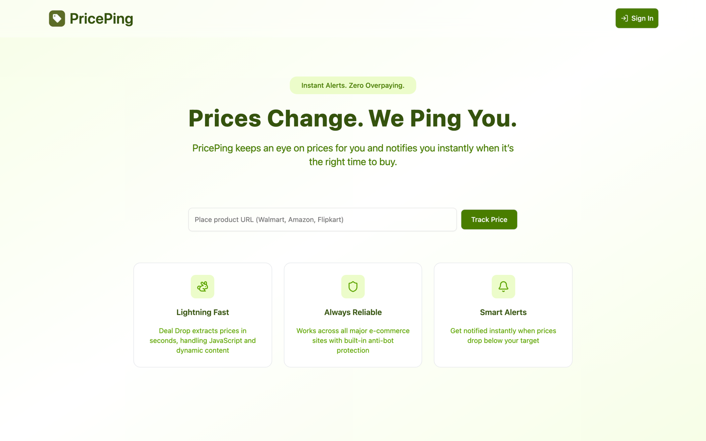
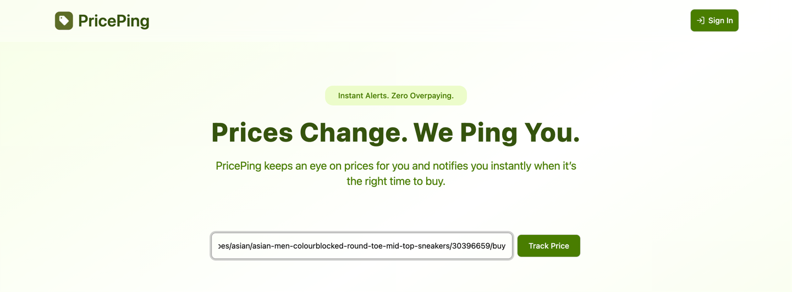
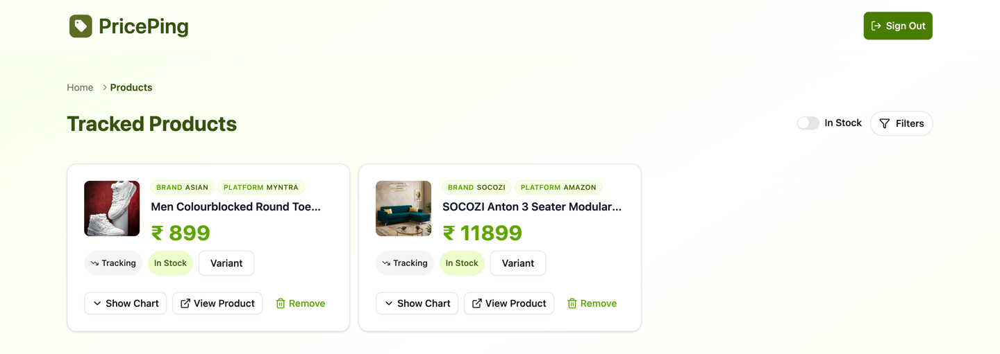
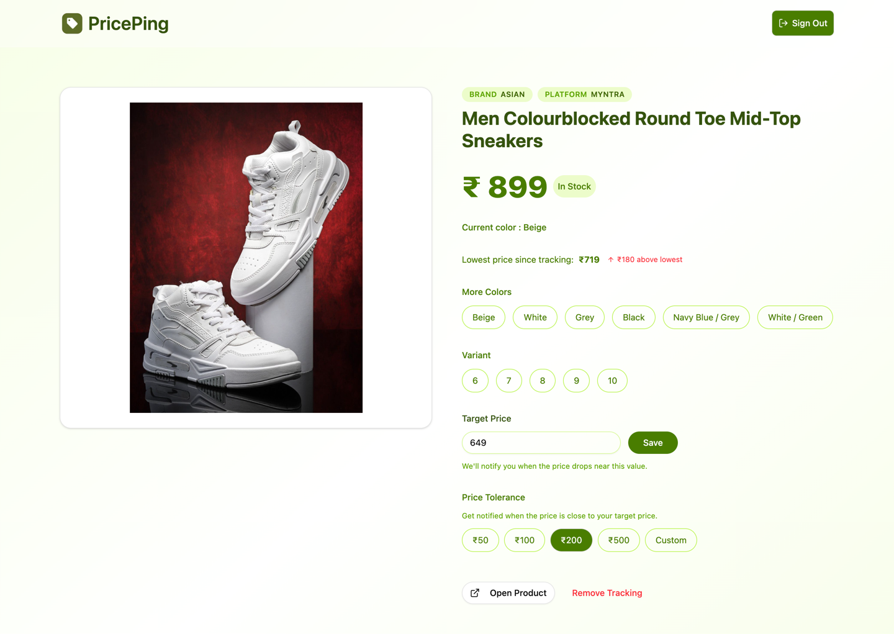
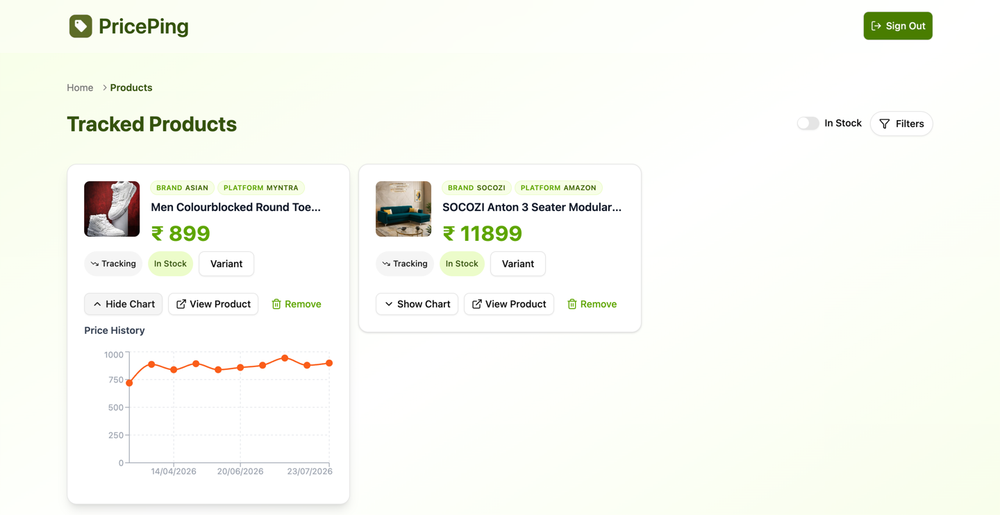
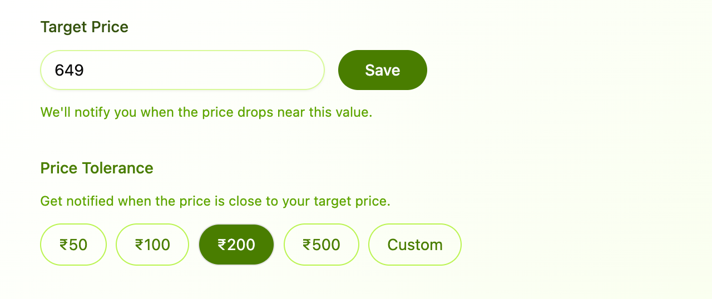
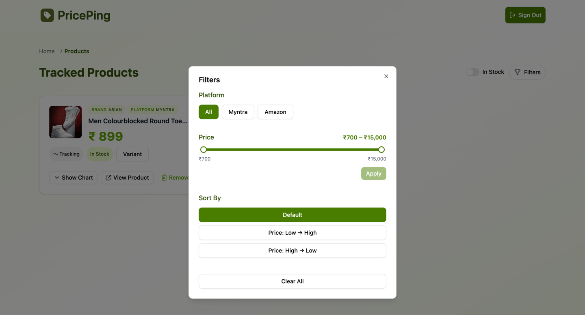
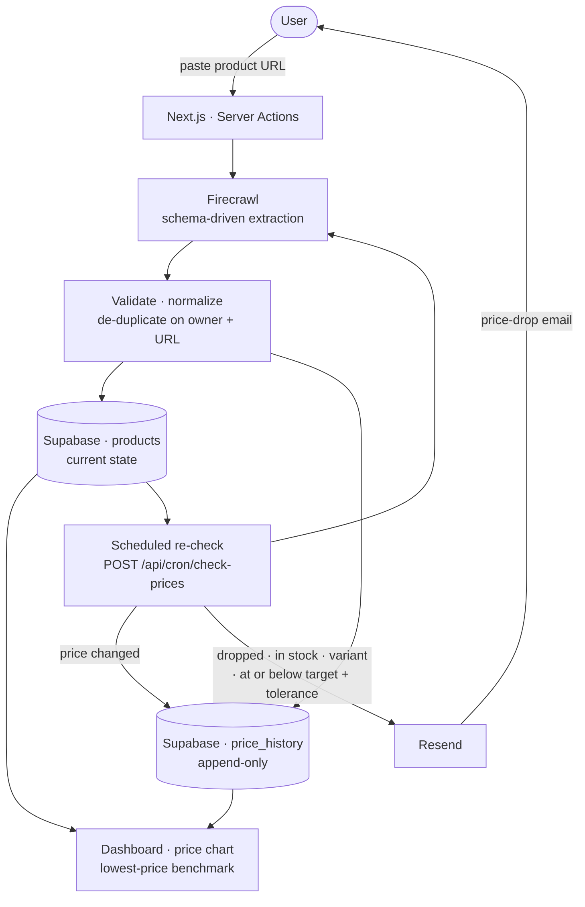

# PricePing

PricePing tracks product prices from supported product pages you paste in, records every change it observes, and emails you when the price reaches the point you'd actually buy at. It's for online shoppers who don't want to re-check the same page daily — or be sold a "discount" off an inflated list price.

## Product Preview



## Product Screenshots

|                                                     |                                                       |
| --------------------------------------------------- | ----------------------------------------------------- |
|        |  |
| Paste any product URL to start tracking             | Tracked products with stock and variant state         |
|  |        |
| Extracted product data and lowest-price benchmark   | Observed price changes over time                      |
|         |                    |
| Target price and tolerance decide when alerts fire  | Platform, price-range and sort filters                |

**Live demo:** [pingprice.vercel.app](https://pingprice.vercel.app)

**Source Code: Private**

> The source code is private because PricePing is being developed as a potential commercial product. This repository provides a public showcase of the product, architecture, technical decisions, and engineering approach.

## Key Features

- **Track by URL** — paste a product link; no extension, no manual entry.
- **Automated extraction** — name, price, currency, image, brand, platform, stock, sizes and colours read off the page.
- **Price history** — each observed change stored and charted.
- **Lowest-price benchmark** — the lowest price since tracking began, and how far above it today sits.
- **Target price + tolerance** — the price you'd buy at, and how close counts as close enough.
- **Variant-aware alerts** — pick a size; drops only alert if that size is available.
- **Email alerts** — old price, new price, saving, percentage and a link back.
- **Scheduled re-checks** — a secured endpoint re-scrapes every product and extends its history.
- **Dashboard filters** — platform, in-stock, price range; sort by price.
- **Google sign-in** — each user sees only their own products.

## Architecture



**Extraction.** Firecrawl renders the page and returns fields matching a JSON schema, name and price required. Missing either, the product is rejected rather than stored half-populated.

**Persistence.** Products are keyed on owner plus URL, so re-adding one is reported as a duplicate. Row-level security scopes every read to its owner.

**History.** The series is append-only, written only when the observed price differs from the stored one. The chart and lowest-price benchmark both read from it.

**Alerts.** The scheduled check compares each fresh price against the stored one, and a drop must clear three gates before an email is sent: in stock, chosen variant available, and at or below target plus tolerance.

## Tech Stack

**Frontend** — Next.js App Router, React 19, Tailwind CSS v4, shadcn/ui on Radix primitives, Recharts, lucide-react, Sonner.

**Backend / Data** — Supabase Postgres with row-level security, Server Actions, one Route Handler for scheduled work.

**Data extraction** — Firecrawl, schema- and prompt-driven.

**Authentication** — Supabase Auth, Google OAuth, cookie sessions refreshed per request.

**Notifications** — Resend.

**Tooling / Deployment** — ESLint (`next/core-web-vitals`), Vercel, ticketed branch-and-PR workflow.

## Technical Decisions

**Schema-driven extraction over per-site scrapers** → Every retailer marks up prices differently, and CSS selectors break silently on redesign → one schema covers new retailers without new code.

**Append-only history, written only on change** → A row per check would grow without bound and bury real movements in duplicates → the stored series is a list of actual price changes, exactly what the chart and benchmark need.

**Alerts gated on target price plus tolerance** → Alerting on any drop is noise, but an exact target is rarely hit — ₹2,050 against a ₹2,000 target still matters → intent is stated once, and near misses still reach you.

**Scheduled work behind a secret-protected route handler** → Re-scraping every product is long-running and has no user session to borrow → the endpoint rejects unauthenticated calls, runs the batch with a service-role client, and stays independent of any one platform's scheduler.

**Server Actions instead of a separate API layer** → Every mutation is first-party and already authenticated by the session cookie → no hand-written fetch layer, and keys never reach the client bundle.

**Filter state in URL search params, resolved server-side** → Filtered dashboards should be shareable and survive a reload → filtering and sorting run as database queries, not client-side array work.

## Engineering Challenges

**Inconsistent product pages** → Prices, availability and variants sit in different markup on every site, some rendered client-side → delegate rendering and extraction to Firecrawl against a declared schema with required fields → many platforms through one code path, failures surfacing as errors rather than corrupt records.

**Extracted values arrive dirty** → Image URLs came back wrapped in serialisation artefacts, pointing at placeholder hosts, or carrying low-resolution CDN transforms → a sanitising layer strips artefacts, rejects placeholder hosts and rewrites CDN paths to the original → images render sharply; unusable URLs fall back to an empty state.

**Availability is prose, not a boolean** → "Sold out", "Notify me", "Only few left" and "Add to bag" all describe stock, inconsistently → normalise against signal lists into in-stock / out-of-stock / unknown, then combine with the extracted boolean → one state drives the badge, the filter and the alert gate, so UI and email can't disagree.

**Not alerting on the wrong thing** → A drop on an out-of-stock item, or in a size the user doesn't wear, is a false alarm → availability, variant match and target-plus-tolerance act as sequential gates → emails match a purchase the user could actually make.

**Filter bounds derived from live data** → A price slider's range depends on what the user tracks, and raw min/max give unusable bounds → read the true bounds from the database, round outward to human numbers, and treat a handle parked at either end as "no limit" → the filter reads naturally at any price scale without hiding a product that should match.

## Performance & Reliability

- **Batch isolation** — each product in the scheduled run has its own error boundary, so one failed scrape can't abort the batch; the run reports counts for updated, failed, changed and alerted.
- **Query shaping** — filters and sort are pushed into the database query, not applied in memory; independent dashboard queries run concurrently.
- **Scoped reads** — reads are constrained by owner as well as id, so an unauthorised id redirects instead of returning data.
- **External API usage** — one scrape per product per add, one per scheduled run; history rows written only on real change.
- **Loading and empty states** — route progress bar, form spinner, chart loader, and separate empty states for "nothing tracked" and "nothing matches this filter".
- **Failure surfaces** — extraction failures, duplicates and validation errors render as toasts.
- **Responsive layout** — mobile-first grids and controls.

Retries, caching and rate-limit handling around the scraping API are not implemented; failed products are counted and retried next run.

## Engineering Practices

```text
Ticketed feature branch (PP-##)
            ↓
Pull request → review
            ↓
ESLint · next/core-web-vitals
            ↓
Merge to main
            ↓
Vercel build & deploy
```

One branch and one pull request per ticket, merged into `main`. Deployment runs on Vercel from the repository, with production tracking `main`. Every credential — extraction key, database keys, email key, scheduler secret — is an environment variable, never committed.

Automated CI checks on pull requests (lint, build, dependency audit, code scanning) and a test suite are not yet in place; linting and builds run locally and at deploy time. Wiring those into GitHub Actions is the next step.

## High-Level Project Structure

```text
PricePing
├── Product Tracking          URL submission, de-duplication, product records
├── Product Data Extraction   schema-driven scraping and field normalisation
├── Price History             append-on-change series and lowest-price benchmark
├── Price Comparison          target price, tolerance, variant and stock gates
├── Alerts                    transactional price-drop email
├── Scheduled Processing      secured batch re-check of every tracked product
├── Dashboard                 filtering, sorting and product management
├── Authentication            Google OAuth with per-user data scoping
└── Database                  Postgres with row-level security
```

## Engineering Takeaways

- **Integrating third-party services** — extraction, database, auth and email, each with its own failure mode.
- **Treating external data as unreliable** — a required-field contract, sanitised values, free text normalised into states the app can reason about.
- **Work that outlives a request** — recurring processing behind a secured endpoint with per-item error isolation.
- **Modelling time** — current state kept separate from an append-only series, so history stays queryable and cheap.
- **Notifications people trust** — intent encoded as thresholds, and no alert that doesn't match a real purchase.

---

Built by [Monisha Chaurasia](https://github.com/77Monisha).
